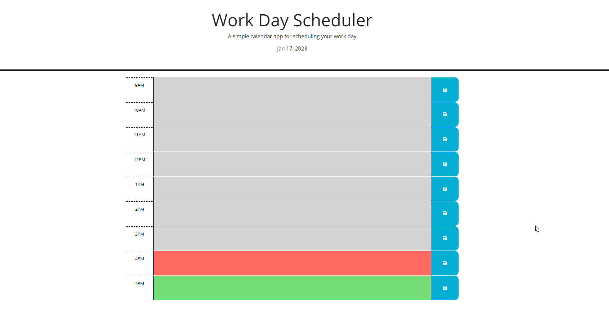

# Description

The goal for this challenge is to create a daily planner to keep track of important tasks and events. I recieved a starter code that contained the CSS stylesheet and HTML elements to help me get started with my application. I used components of the Day.js library when dealing with time and also applied what I learned about Jquery to build this aplication, so that this webpage can help end users manage their time effectively.

Here is the link to my page: https://aliyajeylani.github.io/work_day_scheduler/

# Installation

N/A

# Usage

Here is the link to my github repository: https://github.com/aliyajeylani/work_day_scheduler

# Credits

N/A

# License 

N/A
